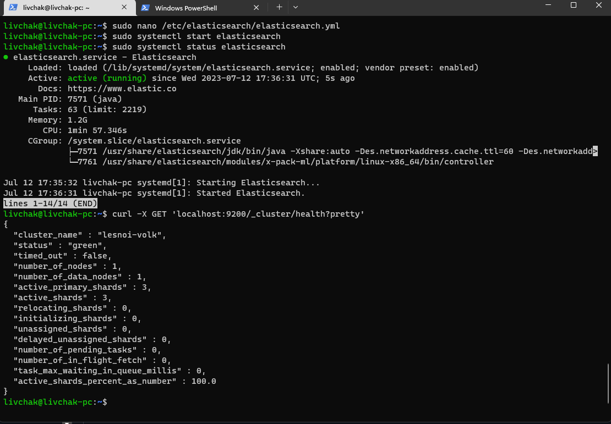
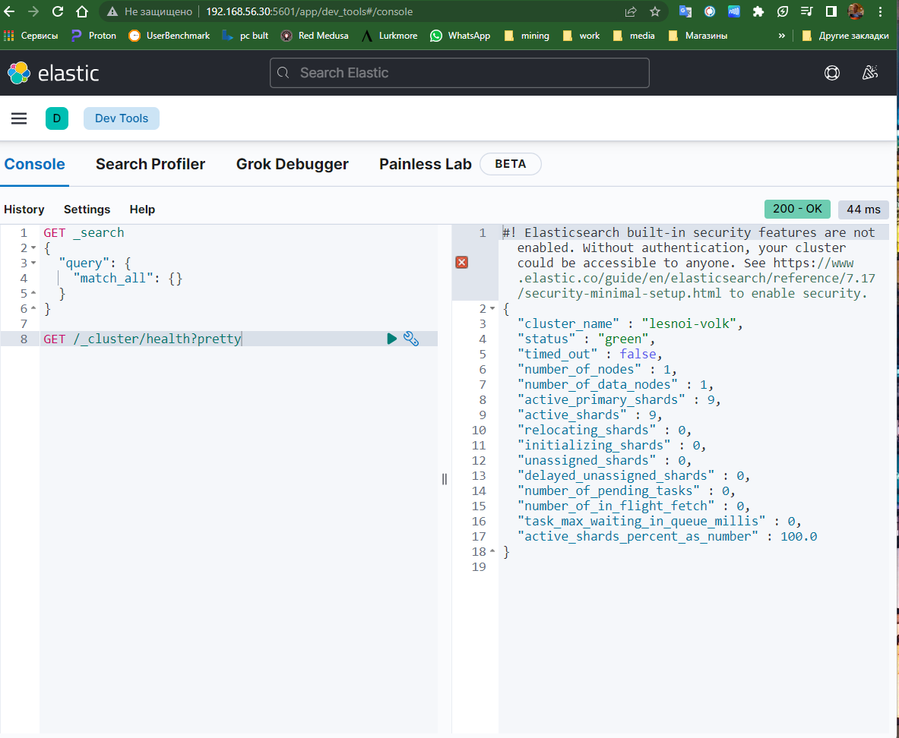
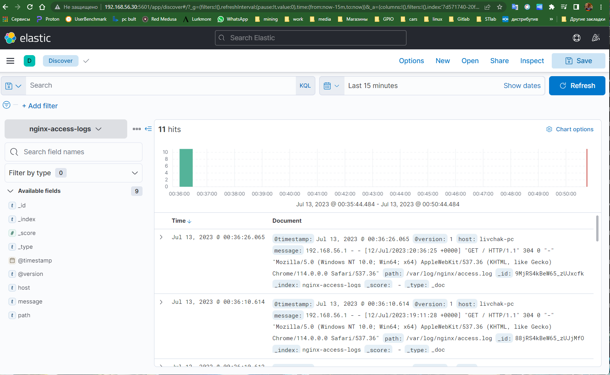
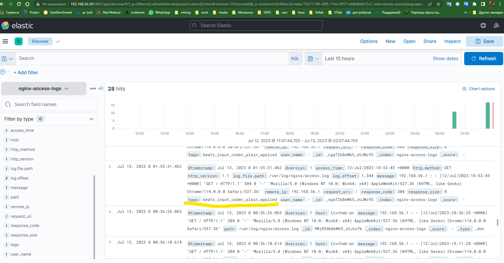

# Домашнее задание к занятию "`11-03hw`" - `Ливчак Сергей`

---

### Задание 1

`Установите и запустите Elasticsearch, после чего поменяйте параметр cluster_name на случайный.`

**Скриншот 1-1_1** 

---

### Задание 2

`Установите и запустите Kibana.`

**Скриншот 2-1_1** 

---

### Задание 3

`Установите и запустите Logstash и Nginx. С помощью Logstash отправьте access-лог Nginx в Elasticsearch.`

**Скриншот 3-1_1** 

### Задание 4

`Установите и запустите Filebeat. Переключите поставку логов Nginx с Logstash на Filebeat.`

**Скриншот 4-1_1** 

---

